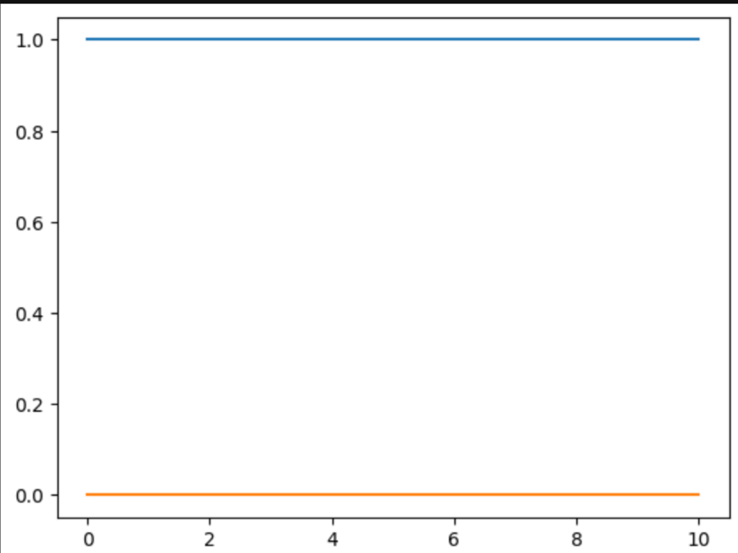

# Código Ejemplo

Un ejemplo de como utilizar estas funciones es el siguiente:

Primero se debe definir un operador para la función que deseamos evaluar, en este caso usaremos:
    
    oOper = np.array([[0, 1], [1, 0]])

También debemos definir un estado inicial para el sistema: 
    
    yInit = np.array([[1, 0], [0, 0]])

Con estos dos elementos definidos podemos utilizar la función `dyn_generator` para obtener f(t, y(t)), que en este caso nos daría la siguiente matriz:

[0.-0.j  0.+1.j]          
[0.-1.j  0.-0.j]

Ahora es necesario definir otros elementos para evaluar el sistema, por ejemplo:

Se necesita crear un array que contiene los tiempos en los que se va a evaluar el sistema: 
 
    times = np.linspace(0,10,40)

Se debe crear una variable que contenga la información sobre el salto temporal de cada iteración:

    h = times[1] - times[0]

Para este ejemplo nos interezan solamente las entradas 0,0 y 1,1 de la matriz que describe el estado del sistema, por lo que vamos a crear 2 arrays para almacenar estos datos conforme se itera sobre el sistema:

    stateQuant00 = np.zeros(times.size)
    stateQuant11 = np.zeros(times.size)

Finalmente, podemos crear el for loop que itera sobre el sistema para evaluar como cambia a través del tiempo:

    for tt in range(times.size):

        stateQuant00[tt] = yInit[0,0]
        stateQuant11[tt] = yInit[1,1]

        yN = rk4(dyn_generator, times[tt], yInit, h)

        yInit = yN

Si graficamos los datos obtenidos obtenemos lo siguiente:

